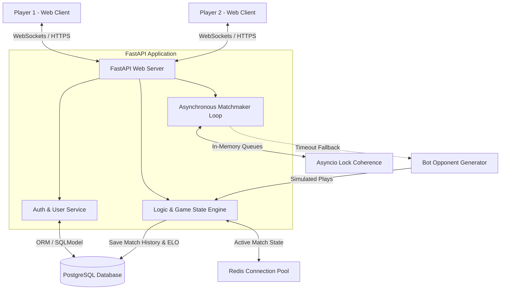

# LogicArena

[](https://logicarena.space)
[](https://fastapi.tiangolo.com)
[](https://react.dev)
[](https://www.postgresql.org)
[](https://redis.io)

**LogicArena** is a high-performance, real-time competitive multiplayer platform designed to gamify Boolean algebra and digital logic. Players engage in fast-paced 1v1 duels, solving complex logical circuits to climb the global ELO leaderboard. 

**Live Application**: [logicarena.space](https://logicarena.space)

---

## Game Modes

LogicArena challenges players' logical reasoning through three unique, dynamically generated game modes:

### Mode 1: Faulty Gate Detection
Players are presented with a digital logic circuit where exactly one gate is malfunctioning (injecting a bit-flip into its output). By analyzing the inputs and the resulting wire values, players must race to identify the exact coordinates/ID of the buggy gate.

### Mode 2: Output Evaluation
A speed-solving mode where players are shown a randomized circuit layout with a set of binary inputs. The objective is to evaluate the circuit gates sequentially and calculate the final output bits before their opponent does.

### Mode 3: Logic Crossword Grid
A crossword-style puzzle played on a 2D grid. The board contains static value cells and empty "holes". Players are given an inventory of logic gates and binary values and must place them into the grid so that all interconnected rows and columns evaluate consistently.

---

## Backend Architecture & System Design

The backend is built using a modern, asynchronous Python stack designed for low-latency real-time communication and high concurrency.



### Architectural Components

1. **Stateful WebSocket Gateway ([arena.py](file:///home/devxdebanjan/Extended/Docs/PyCode/LogicArena/backend/app/routes/arena.py))**:
   - Manages persistent, bi-directional client connections.
   - Handles real-time gameplay actions: joining queues, creating private friend rooms, resigning, and submitting answers.

2. **Asynchronous Matchmaker ([matchmaker.py](file:///home/devxdebanjan/Extended/Docs/PyCode/LogicArena/backend/app/services/matchmaker.py))**:
   - Runs as a non-blocking background task in the FastAPI lifespan.
   - Groups players into queues based on game mode and pairs them using an ELO rating tolerance window of $\pm 200$.
   - **Smart Bot Fallback**: To prevent queue starvation, if a player remains unmatched for more than 2 seconds, the matchmaker automatically provisions an adaptive bot opponent matching the player's skill level.

3. **Decoupled Game & Logic Engines ([engine/](file:///home/devxdebanjan/Extended/Docs/PyCode/LogicArena/backend/app/engine))**:
   - Contains pure functional engines to generate random circuit topologies, evaluate outputs, and validate solutions. 
   - Decoupled from WebSockets and HTTP routes to ensure high testability.

4. **Persistence Layer**:
   - **PostgreSQL**: Stores persistent relational data such as user accounts, hashed passwords, matches, and ELO ratings using **SQLModel** (which combines **SQLAlchemy** and **Pydantic** for unified type safety).
   - **Redis**: Used for connection tracking, caching, and fast session management.

---

## Key Engineering Highlights

### Zero-Trust Anti-Cheat Verification
To prevent players from inspecting their browser's network traffic to find answers, the system uses a **stateless cryptographic signature** design:
1. When a puzzle is generated, the backend computes the correct answer.
2. It hashes the answer with a cryptographically secure, single-use `nonce` and the application's private secret key.
3. This hash is packaged into a short-lived JSON Web Token (JWT) and sent to the client alongside the puzzle.
4. The client's browser has **no access to the raw answer**.
5. Upon submission, the client sends their answer and the JWT back. The backend decodes the token, hashes the user's input with the token's nonce, and compares the result.
*Benefit: The backend validates answers instantly without querying the database or storing active puzzle answers in memory.*

### Adaptive Bot Simulation
When matching with a bot, the backend spawns a simulated player. The bot's solving speed and accuracy are calculated dynamically using the human player's ELO. This ensures that new players get a gentle learning curve while high-ranking players face challenging opponents.

### Automatic Memoization with React Compiler
The frontend utilizes the new **React Compiler** (`babel-plugin-react-compiler`) in React 19. This eliminates the need for manual `useMemo` and `useCallback` optimization, ensuring the highly interactive SVG-based logic circuits render at a buttery-smooth 60 FPS during fast-paced matches.

---

## Tech Stack & Tools

### Backend
- **FastAPI**: Modern, high-performance web framework for building APIs.
- **SQLModel / SQLAlchemy**: Unified SQL database interaction with Python type hints.
- **Alembic**: Database migration management.
- **Redis (aioredis)**: High-speed caching and connection management.
- **python-jose & passlib**: Secure JWT-based authentication and bcrypt password hashing.
- **uv**: Next-generation, ultra-fast Python package installer and resolver.

### Frontend
- **React 19**: Standard for building component-based, interactive user interfaces.
- **Vite 8**: Frontend build tool providing lightning-fast Hot Module Replacement (HMR).
- **ESLint & Babel**: Ensuring code linting, quality, and compilation optimized for React 19.

---

## Project Structure

```text
LogicArena/
├── backend/                  # FastAPI Application
│   ├── alembic/              # Database migration scripts
│   ├── app/
│   │   ├── api/              # REST Endpoints (Auth, Users, Health)
│   │   ├── config/           # Database, Redis, and Settings configuration
│   │   ├── core/             # Middlewares, exceptions, and WS managers
│   │   ├── engine/           # Game logic & circuit evaluation engines
│   │   ├── models/           # SQLModel database schemas
│   │   ├── routes/           # WebSocket match routes & practice API
│   │   └── services/         # Matchmaking, Bot simulation, and ELO calculations
│   ├── pyproject.toml        # Backend dependencies and metadata
│   └── docker-compose.yml    # Development database and Redis setup
└── frontend/                 # React Single Page Application
    ├── src/
    │   ├── assets/           # Static assets
    │   ├── components/       # Reusable UI elements & SVG circuit renderers
    │   └── App.jsx           # Main application router and state
    ├── package.json          # Frontend dependencies and scripts
    └── vite.config.js        # Vite configuration with React Compiler
```
